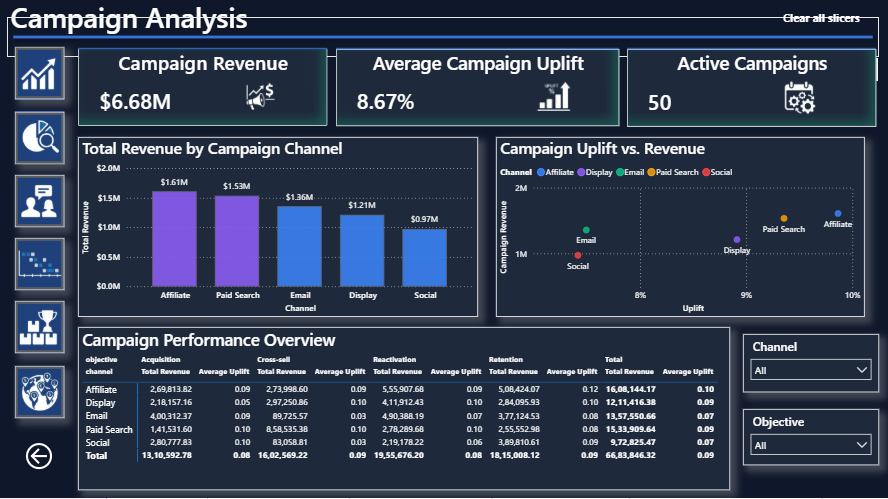
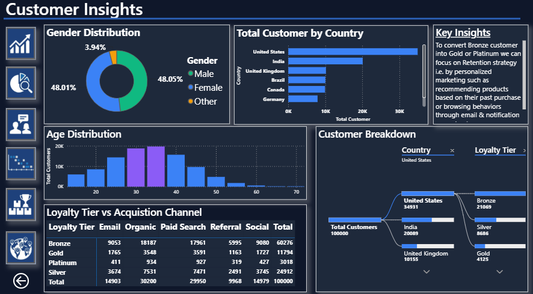

# 📊 E-Commerce & Marketing Analytics Dashboard

## 🏆 Achievement

🥇 **Winner — Dashboard of the Batch Competition**

This project was created as part of my Data Analytics learning journey to analyze e-commerce and marketing data and transform it into meaningful, actionable business insights using Microsoft Power BI.

---

# 📌 Project Overview

The **E-Commerce & Marketing Analytics Dashboard** is an interactive Power BI dashboard designed to provide a comprehensive view of e-commerce performance, customer behavior, marketing campaign performance, product performance, user engagement, and transaction trends.

The project combines data from multiple business areas and presents the analysis through interactive visualizations, KPIs, filters, and drill-down analysis.

The goal of the dashboard is to help businesses understand their customers, evaluate marketing performance, identify high-performing products, analyze purchasing behavior, and discover opportunities for growth and customer retention.

---

# 🎯 Business Objectives

The main objectives of this project were:

- 📈 Analyze overall e-commerce performance
- 💰 Understand transaction and revenue trends
- 👥 Analyze customer behavior and purchasing patterns
- 📢 Evaluate marketing campaign performance
- 🛍️ Identify high-performing products
- 🖱️ Understand user events and engagement
- 🔄 Identify opportunities to retain and win back customers
- 🌎 Analyze geographical transaction patterns
- 💡 Generate actionable business recommendations
- 📊 Support data-driven decision making

---

# 🛠️ Tools & Technologies

| Tool / Technology | Purpose |
|---|---|
| 🟦 **Power BI** | Dashboard development and data visualization |
| 🔄 **Power Query** | Data cleaning and transformation |
| 📐 **DAX** | Measures and analytical calculations |
| 🗂️ **Data Modeling** | Connecting and analyzing multiple datasets |
| 📊 **Data Visualization** | Presenting business insights interactively |

---

# 🗃️ Dataset

The project uses five interconnected datasets covering marketing campaigns, customers, user events, products, and transactions.

## 📢 Campaigns

Contains information related to marketing campaigns and is used to analyze campaign performance and effectiveness.

## 👥 Customers

Contains customer-level information used to understand customer behavior, purchasing patterns, and customer-related trends.

## 🖱️ Events

Contains user interaction and event data used to understand customer engagement and behavior throughout the e-commerce journey.

## 🛍️ Products

Contains product-related information used to analyze product performance and identify products contributing to business performance.

## 💳 Transactions

Contains transaction-level information used to analyze sales, orders, revenue, purchasing activity, and transaction trends.

---

# 🔄 Data Preparation & Modeling

The raw datasets were prepared and transformed in Power BI before building the dashboard.

The data preparation process included:

- 🧹 Data cleaning
- 🔄 Data transformation using Power Query
- 🔗 Establishing relationships between tables
- 🗂️ Data modeling
- 📐 Creating DAX measures
- 📊 Creating calculated business metrics
- 🎨 Designing interactive dashboard visuals

---

# 📑 Dashboard Pages

The dashboard consists of **6 interactive pages**, each focusing on a different aspect of the e-commerce and marketing business.

---

## 1️⃣ Executive Overview

Provides a high-level overview of the overall business performance.

This page brings together important KPIs and visualizations to provide a quick understanding of e-commerce performance and major trends.

### Focus Areas

- 💰 Overall performance
- 🧾 Transactions
- 👥 Customers
- 📈 Trends
- 🛍️ Product performance
- 📢 Marketing performance

---

## 2️⃣ 📢 Campaign Analysis

This page focuses on marketing campaign performance.

It helps evaluate campaign activity and understand how marketing initiatives are performing.

### Focus Areas

- 📢 Campaign performance
- 👥 Customer response
- 📈 Campaign trends
- 🎯 Marketing effectiveness
- 💡 Opportunities for campaign optimization

---

## 3️⃣ 👥 Customer Insights

This page focuses on customer behavior and purchasing patterns.

It helps identify different customer trends and opportunities to improve customer retention.

### Focus Areas

- 👥 Customer behavior
- 🛒 Purchasing patterns
- 💰 Customer value
- 🔄 Customer retention
- 🎯 Customer targeting

---

## 4️⃣ 🖱️ Event & User Behavior

This page analyzes user events and interactions to understand how customers engage with the e-commerce platform.

### Focus Areas

- 🖱️ User events
- 👥 Customer engagement
- 📈 User behavior
- 🔄 Customer journey
- 💡 Engagement opportunities

---

## 5️⃣ 🛍️ Product Performance

This page focuses on product-level analysis.

It helps identify products that perform well and provides insights that can support product strategy.

### Focus Areas

- 🏆 Top-performing products
- 💰 Product sales
- 📊 Product contribution
- 🛒 Purchasing patterns
- 🔄 Cross-selling opportunities

---

## 6️⃣ 🌎 Transaction & Geo Analysis

This page analyzes transaction patterns along with geographical information.

It helps identify how transactions are distributed geographically and highlights potential regional opportunities.

### Focus Areas

- 💳 Transaction performance
- 🌎 Geographical distribution
- 📍 Regional trends
- 📈 Transaction patterns
- 💡 Regional growth opportunities

---

# 📊 Key KPIs

The dashboard tracks important e-commerce and marketing metrics such as:

- 💰 **Total Sales**
- 🧾 **Total Transactions**
- 👥 **Total Customers**
- 🛒 **Average Order Value (AOV)**
- 📈 **Conversion Rate**
- 📢 **Campaign Performance**
- 🛍️ **Product Performance**
- 🖱️ **User Engagement**

---

# 🔍 Key Insights

The dashboard helps businesses identify:

- 🏆 High-performing products
- 👥 Customer purchasing patterns
- 📢 Marketing campaign performance
- 🖱️ User engagement patterns
- 🔄 Opportunities to re-engage lapsed customers
- 🛒 Cross-selling and upselling opportunities
- 🌎 Geographical transaction patterns
- 📈 Potential areas for business growth

---

# 💡 Business Recommendations

Based on the analysis, several strategies can be considered to improve e-commerce performance.

### 🔄 Customer Win-Back Campaigns

Target lapsed or inactive customers with personalized offers, discounts, and relevant product recommendations to encourage repeat purchases.

### 🛒 Cross-Selling

Recommend complementary products based on a customer's previous purchase.

For example, if a customer purchases a laptop, the business could recommend a laptop bag, mouse, keyboard, or other accessories.

### 📈 Upselling

Recommend higher-value or upgraded products when appropriate to increase the value of individual transactions.

### 👥 Customer Segmentation

Segment customers based on purchasing behavior and engagement levels to create more targeted marketing campaigns.

### 📢 Campaign Optimization

Identify better-performing campaigns and use those insights to optimize future marketing campaigns.

### 🎯 Personalized Recommendations

Use customer purchasing behavior and product patterns to provide more relevant product recommendations.

### ❤️ Customer Retention

Develop loyalty offers, personalized promotions, and targeted communication to encourage repeat purchases.

### 🌎 Regional Marketing

Use geographical transaction patterns to identify regions with strong performance as well as regions with potential for growth.

---

# 🖥️ Dashboard Preview

## 1. Executive Overview


---

## 2. Campaign Analysis



---

## 3. Customer Insights



---

## 4. Event & User Behavior


---

## 5. Product Performance


---

## 6. Transaction & Geo Analysis


---

# 📂 Project Structure

```text
ecommerce-marketing-analytics-dashboard/
│
├── 📄 README.md
│
├── 📊 Ecommerce_Marketing_Analytics_DOB.pbix
│
├── 📑 Project_Report.pdf
│
└── 📁 Screenshots/
    │
    ├── 🖼️ Executive_Overview.png
    ├── 🖼️ Campaign_Analysis.png
    ├── 🖼️ Customer_Insights.png
    ├── 🖼️ Event_User_Behavior.png
    ├── 🖼️ Product_Performance.png
    └── 🖼️ Transaction_Geo_Analysis.png
